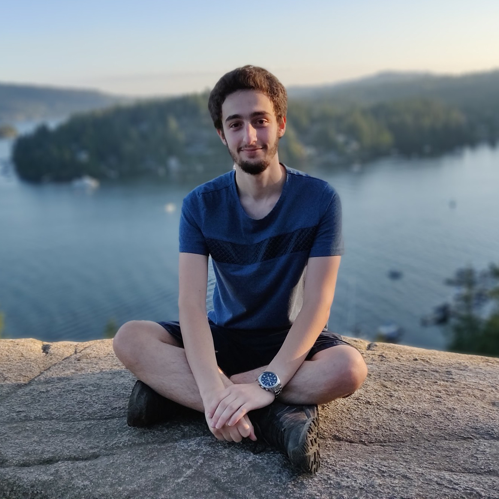

{:.center width="400px" align="center" srcset="/assets/img/blog/arthur-pesah.jpg"}

I am an incoming PhD student at University College of London (UCL), 
enrolled in the [CDT in Delivering Quantum Technologies](https://www.ucl.ac.uk/quantum/study-here/cdt-delivering-quantum-technologies), starting in the Fall 2020. 
I am passionate about research in quantum computing and machine learning, 
particularly their theoretical aspects and how they can help each other. 
I have worked in a variety of topics in ML (domain adaptation, likelihood-free inference, 
federated learning), high-energy physics (impedance models in particle accelerators) 
and quantum computing (variational circuits, quantum annealing, quantum control).

I have recently graduated from a MSc with a double degree in applied mathematics and 
theoretical physics from [ENSTA ParisTech](http://www.ensta-paristech.fr/en) (Saclay, France) and 
[KTH Royal Institute of Technology](https://www.kth.se/en) (Stockholm, Sweden). 
I did my [master's thesis](http://www.diva-portal.org/smash/record.jsf?pid=diva2%3A1320072&dswid=-7150) on variational quantum circuits for quantum data 
at the University of Toronto with Pr. Peter Wittek and spent seven months at [1QBit](http://1qbit.com/), 
working on the applications of reinforcement learning to quantum annealing.

Source of the night sky image on the left: [Lukas Schlagenhauf](https://www.flickr.com/photos/lschlagenhauf/)